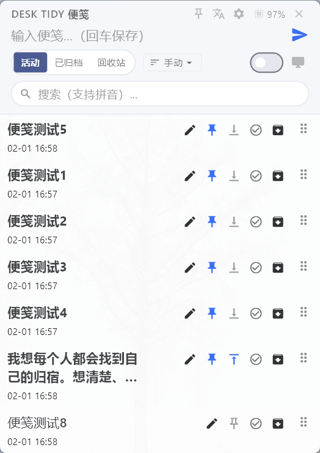
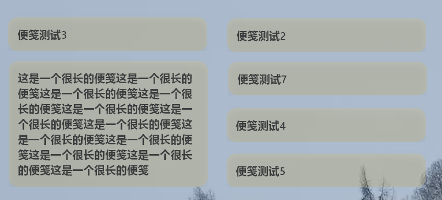
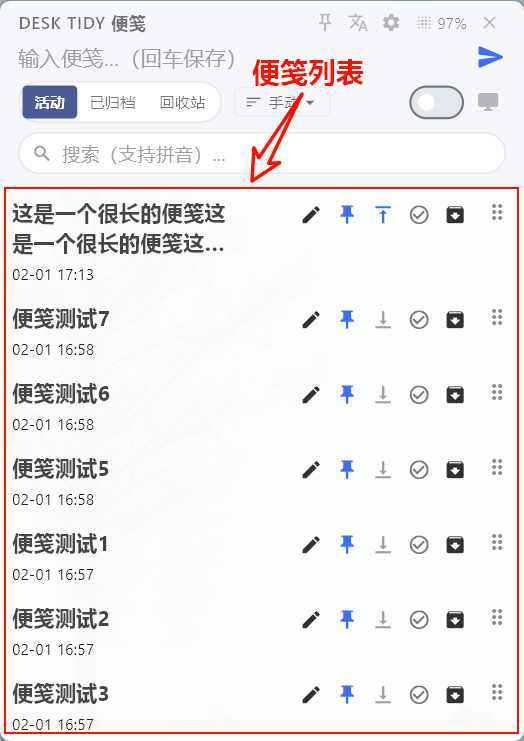
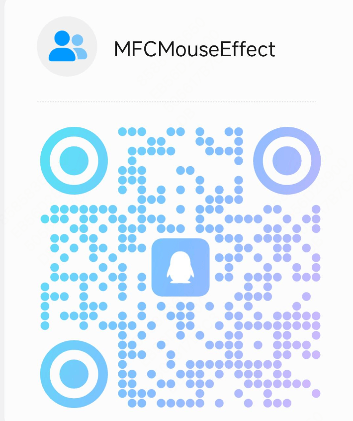

# Desk Tidy Sticky

> A cross-platform desktop sticky note and workstation app. Capture quick thoughts, keep notes on the desktop, plan tasks, and stay in rhythm without leaving one lightweight app.

[中文](README.md) · [Contribute](docs/contributing.md) · [Community](#community) · [GitHub](https://github.com/sqmw/desk_tidy_sticky) · If you like it, please Star

## Intro Video

Watch the Bilibili intro video for a quick look at the main workflows and features:

[▶ Watch the Desk Tidy Sticky intro video on Bilibili](https://www.bilibili.com/video/BV1Ckd8BhES1/)

## Why It Exists

Many sticky note apps only help you write something down. Many Pomodoro apps only help you start a timer. Desk Tidy Sticky is built around the whole working loop: capture a thought in mini mode, pin it to the desktop, organize it into tasks in workstation mode, focus for a while, take a real break, then return to a cleaner flow.

It works well when you want to:

- Keep notes floating while reading papers, watching videos, or coding.
- Capture temporary todos and later move them through active, archived, and trash states.
- Plan today’s work in workstation mode with focus timing and break reminders.
- Keep desktop sticky behavior close across macOS and Windows.

Mode details live in `docs/product/2026-03-29-tauri-modes-overview.md`.

## Highlights

### mini mode: Notes And Desktop Stickies

- Wake the mini panel with `Ctrl + Shift + N`.
- Manage active, archived, and trash notes with Pinyin search support.
- Use tags, priorities, drag reorder, and basic Markdown rendering.
- Pin notes to the desktop with topmost, bottom layer, wallpaper layer, and icon-layer behavior.
- Double-click topmost stickies to enter edit mode while keeping the regular view quiet.

### workstation mode: Tasks And Focus

- Keep notes, tasks, focus timing, and break control in workstation mode.
- Plan tasks, track Pomodoros, and enable task start reminders.
- Use independent short and long breaks, fullscreen break overlays, and postpone rules.
- Tune themes, custom CSS, zoom, font size, and sidebar layout.

## Screenshots

### mini mode

| mini Panel | Desktop Stickies | mini List |
|:---:|:---:|:---:|
|  |  |  |

### workstation mode

| Notes | Focus | Breaks |
|:---:|:---:|:---:|
|  |  |  |

## Shortcuts

| Shortcut | Action |
|---|---|
| `Ctrl + Shift + N` | Show or hide the mini panel |
| `Ctrl + Shift + O` | Toggle sticky mouse interaction |
| `Ctrl + Enter` | Save and pin to desktop |
| `Esc` | Hide the panel |

## Development

- Node.js + pnpm
- Rust stable
- Tauri 2 system dependencies

```bash
pnpm install
pnpm tauri dev
pnpm tauri build
```

Useful checks:

```bash
pnpm check
cargo check --manifest-path src-tauri/Cargo.toml
```

Windows development and sync notes live in `AGENTS.md`.

## Contributing

Contributions are welcome, especially around:

- Desktop sticky layering, transparency, blur, dragging, mouse interaction, and cross-platform behavior.
- Workstation notes, tags, search, editor workflow, themes, and layout.
- Focus tasks, break control, reminders, and statistics.
- Documentation, screenshots, reproduction notes, and platform test records.

Start with `docs/contributing.md`.

## Community

For feedback, ideas, and development discussion, scan the QQ group QR code.



## Support

If Desk Tidy Sticky helps you, please consider starring the project on GitHub. It helps more people find the app and makes it easier to decide what to polish next.

Repository: <https://github.com/sqmw/desk_tidy_sticky>

## Data Migration

When migrating from the Flutter/Dart version, the Windows app scans legacy `notes.json` locations and merges notes by `id` into the current Tauri dataset. Broken files, old fields, or invalid entries are skipped without blocking current notes.

Migration notes:

- `docs/migration/2026-02-06-flutter-to-tauri.md`
- `docs/migration/2026-03-29-flutter-notes-auto-import-compat.md`

## Tech Stack

- Tauri 2
- SvelteKit / Svelte 5
- Rust
- Local JSON storage

## License

MIT License
