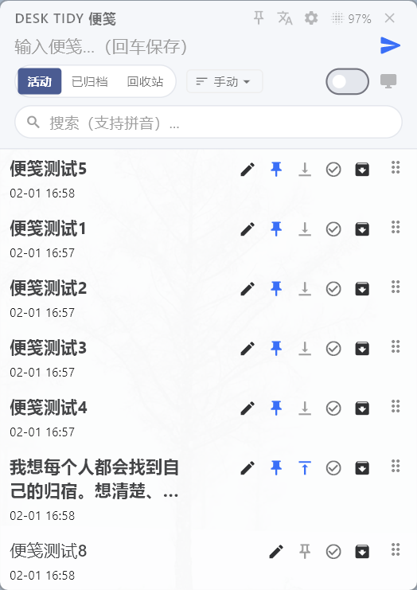
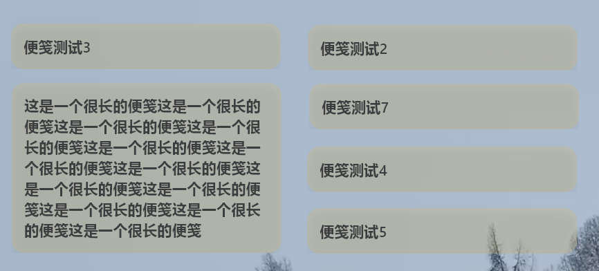
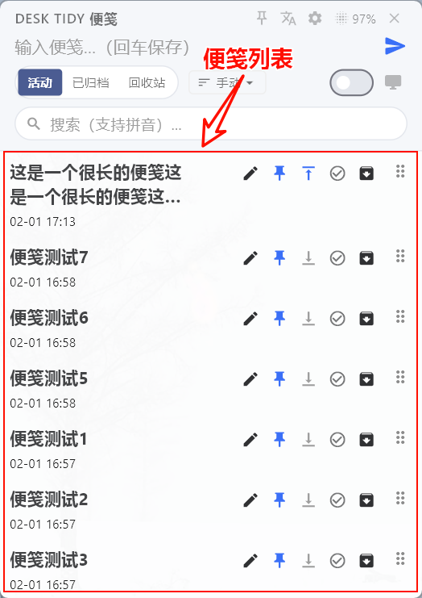

# Desk Tidy Sticky

> 📝 **跨平台极简便签助手** — 随手记录，灵感不丢失

**🇨🇳 中文** | [🇬🇧 English](README.en.md)

## ✨ 功能特性

### 简洁模式（主面板 / 贴纸）

- **极速唤醒**：全局快捷键 `Ctrl + Shift + N`，系统托盘一键呼出
- **简约设计**：磨砂质感 UI，滚轮调节透明度
- **笔记管理**：活动/归档/回收站视图，支持拼音搜索
- **滑动操作**：左滑删除，右滑归档/恢复（与 Flutter 版一致）
- **拖拽排序**：手动排序模式下可拖动笔记调整顺序
- **置顶/置底**：已钉住便笺可切换置顶或贴在底部
- **开机自启**：设置中可开启开机自动启动
- **启动时显示**：可选择启动时是否显示主窗口
- **单实例**：重复启动会激活已有窗口
- **快捷操作**：`Ctrl + Enter` 保存并置顶，`Esc` 隐藏面板

### 工作台模式（Workspace）

- **一体工作台**：笔记、任务与专注聚合在同一窗口
- **多视图笔记**：全部 / 待办 / 四象限 / 归档 / 回收站
- **标签与检索**：标签筛选、搜索栏、右侧详情编辑
- **专注番茄**：任务规划、专注计时、统计概览
- **休息控制**：独立提醒、短休/长休、休息遮罩
- **显示与主题**：主题预设、自定义 CSS、缩放与字号配置

完整模式拆分与模块说明见：`docs/product/2026-03-29-tauri-modes-overview.md`

## ⌨️ 快捷键

| 快捷键 | 功能 |
|-------|------|
| `Ctrl + Shift + N` | 唤醒/隐藏主面板 |
| `Ctrl + Shift + O` | 贴纸：切换鼠标交互（穿透/可点） |
| `Ctrl + Enter` | 保存并固定到桌面 |
| `Esc` | 隐藏面板（不保存） |

## 🖼️ 截图

### 简洁模式

| 主界面 | 贴纸 | 列表 |
|:---:|:---:|:---:|
|  |  |  |

### 工作台模式

| 笔记 | 专注 | 休息 |
|:---:|:---:|:---:|
|  |  |  |

## 🔧 技术栈

- **框架**: Tauri 2 + SvelteKit
- **后端**: Rust
- **数据存储**: 本地 JSON

## 📦 开发

```bash
# 安装依赖
pnpm install

# 开发模式
pnpm tauri dev

# 构建
pnpm tauri build
```

## 📂 数据迁移

从 Flutter/Dart 版本迁移：当前版本会在 Windows 读取笔记时，同时尝试扫描 Flutter 旧路径下的 `notes.json`，并把旧版笔记按 `id` 合并进当前 Tauri 路径；若旧路径里有坏文件、字段版本较老（缺少后续新增字段）或坏条目，只会跳过异常部分，不会影响当前 Tauri 笔记加载。旧路径兼容 `%APPDATA%\desk_tidy_sticky\notes.json`、`%APPDATA%\com.example\desk_tidy_sticky\notes.json`、历史上级目录变体以及 `%LOCALAPPDATA%` 下对应目录。若自动兼容未命中，仍可手动复制。

## 🧭 迁移记录

- `docs/migration/2026-02-06-flutter-to-tauri.md`
- `docs/migration/2026-03-29-flutter-notes-auto-import-compat.md`

## 📄 开源协议

MIT License
