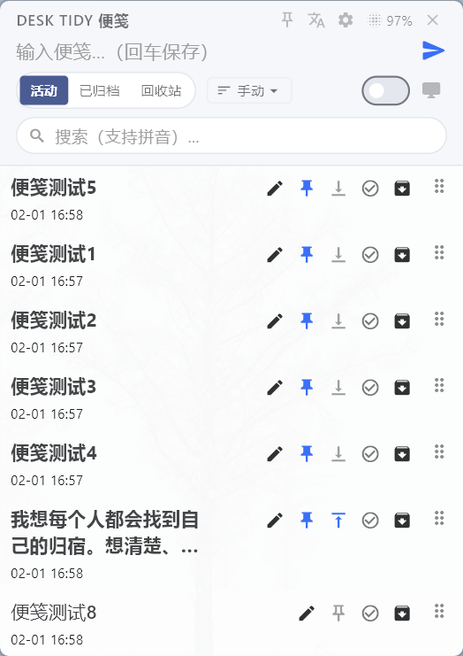
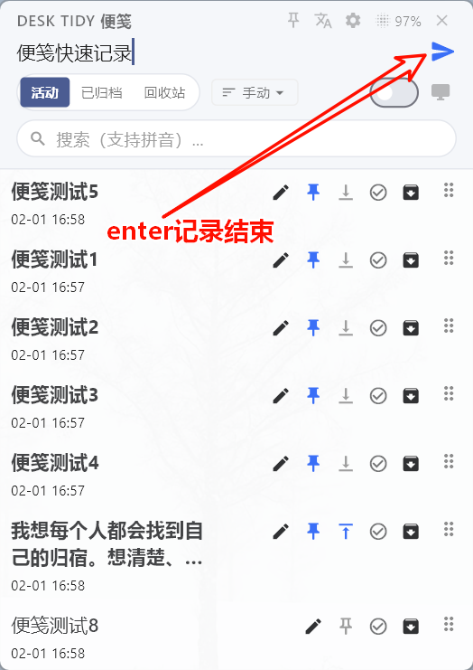
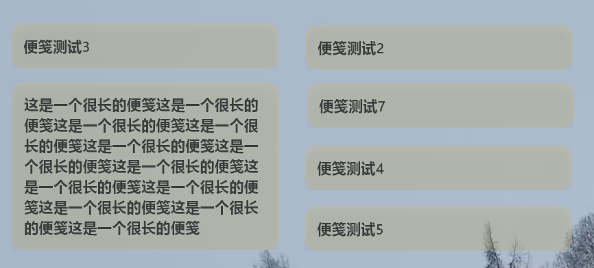
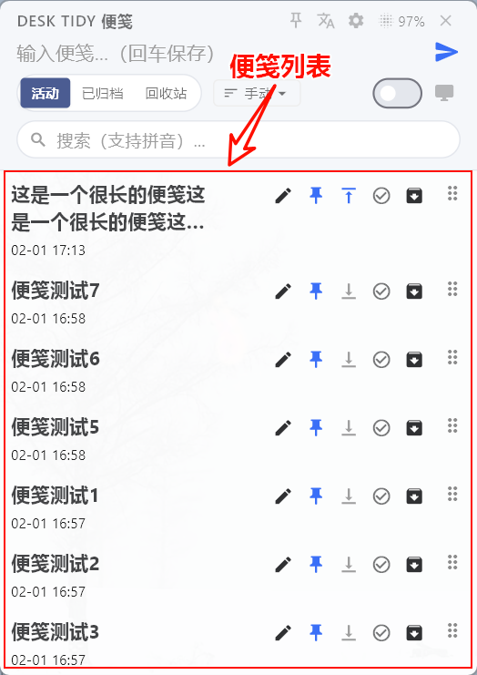

# Desk Tidy Sticky

> 📝 **Minimalist Sticky Notes for Windows** — Capture ideas instantly, never lose a thought.

**[🇨🇳 中文](README.md)** | **🇬🇧 English**

<!-- Main interface screenshot -->


---

## ✨ Features

<table>
<tr>
<td width="50%">

### ⚡ Instant Wake
- **Global Hotkey** `Ctrl + Shift + N`
- One-click access from System Tray
- Launch instantly, record immediately
- Auto-save, never worry about data loss

</td>
<td width="50%">

### 📌 Desktop Stickers
- **Pin Mode**: Pin important notes to desktop
- Embedded in desktop layer, never obscures work windows
- Free drag-and-drop layout
- Double-click to edit directly

</td>
</tr>
<tr>
<td>

### 🎨 Minimalist Design
- Lighter than system sticky notes
- Pure, distraction-free typing experience
- Adaptive Dark / Light themes
- Frosted glass (Acrylic) UI

</td>
<td>

### 🔍 Lightning Search
- Quick retrieval via **Pinyin Initials**
- History notes at your fingertips
- Archive management for a tidy list
- Tag categorization (Coming Soon)

</td>
</tr>
</table>

---

## 🖼️ Preview

<!-- Feature screenshots -->
| Quick Note | Desktop Stickers | Archive List |
|:---:|:---:|:---:|
|  |  |  |

---

## 🚀 Core Functions

### 📝 Quick Capture & Archive
- Capture inspiration anytime, anywhere
- Shortcut Save: `Ctrl + Enter` to save and suspend
- Slide to right to archive, keeping the list clean

<!-- Demo GIF -->


### 📌 Desktop Sticker Mode
Say goodbye to messy windows. Manage layers exactly as you need:

| Mode | Scenario | Description |
|-----|----------|-------------|
| **⬇️ Bottom Layer** | **Part of Wallpaper** | Embedded below icons. Persists even when `Win + D` hides windows. Never blocks your work. |
| **⬆️ Always on Top** | **Critical Reminders** | Floats above everything. Pin with `Ctrl + Enter` so you never miss urgent tasks. |
| **↔️ Free & Easy** | **Drag Anywhere** | Place anywhere on screen. Auto-remembers position just like real sticky notes. |
| **🖱️ Click-Through** | **Zero Interference** | Mouse clicks pass through to icons below. Fully blends into your desktop. |

### 🗂️ Search & Manage
- Powerful local search engine
- Millisecond response time
- Filter by time, content, or status

---

## ⌨️ Shortcuts

| Shortcut | Function |
|-------|------|
| `Ctrl + Shift + N` | Toggle Main Panel |
| `Ctrl + Enter` | Save & Pin to Desktop |
| `Esc` | Hide Panel (No Save) |
| `Enter` | Save Note (Configurable) |

---

## 📦 Installation

### Method 1: Installer (Recommended)

| Item | Size |
|-----|------|
| Installer | **10.2 MB** |

Download the latest version from [Releases](https://github.com/sqmw/desk_tidy_sticky/releases).

### Method 2: Build from Source

```bash
# Clone repository
git clone https://github.com/sqmw/desk_tidy_sticky.git
cd desk_tidy_sticky

# Install dependencies
flutter pub get

# Run
flutter run -d windows --release
```

---

## 🔧 Tech Stack

- **Framework**: Flutter (Windows Desktop)
- **Multi-Window**: desktop_multi_window
- **Embedding**: Win32 WorkerW Injection
- **Storage**: Local JSON / Shared Preferences

---

## 📄 License

MIT License

---

<p align="center">
  <b>⭐ If you find this useful, please give it a Star!</b>
</p>
